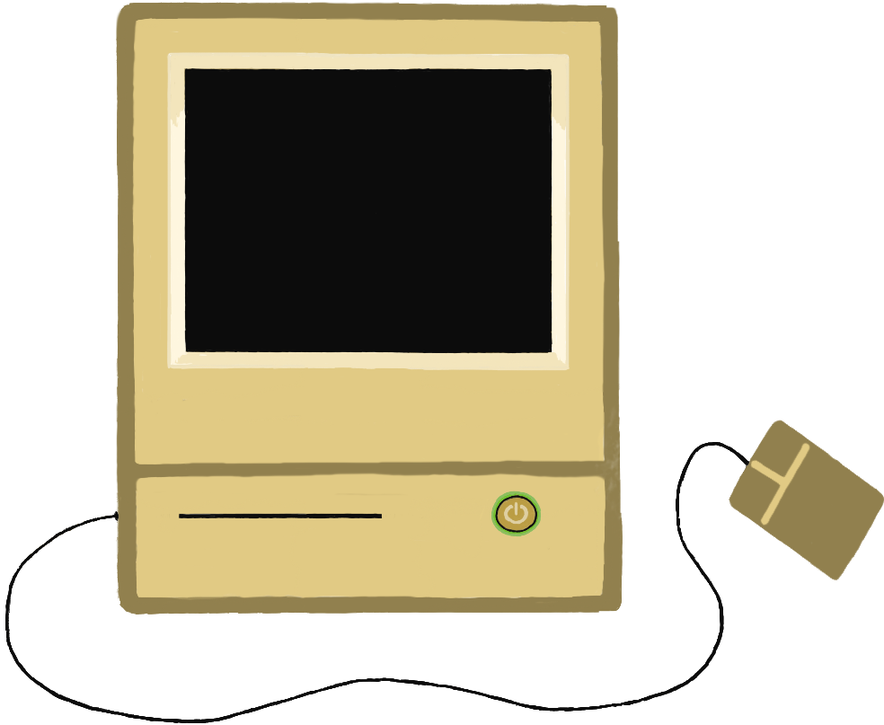
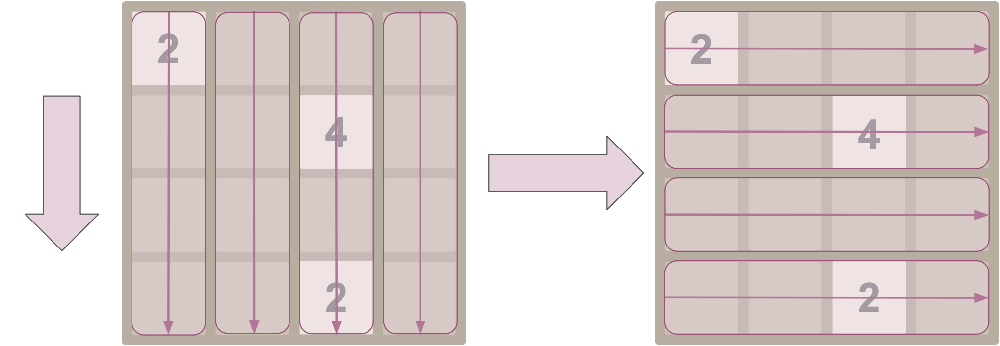

+++
title = "Writing about writing about programming"
date = "2023-06-26"
+++
<script src="/js/penpal_program.js" type="module"></script>
<link rel="stylesheet" href="literate_programming.css">

When I'm being first-order productive, I'm programming: creating and interacting with a system. 

This first-order productivity is great, but it isn't discoverable for others: there's generally a high bar to entry for comprehending another person's work when it's expressed solely as a structured program.

Second-order productivity is when I'm writing about programming, or about systems. This kind of productivity is generally more accessible and distributable, and forms most of the content of this blog!

Third-order productivity involves writing software to help me produce the writing about programming. 

And that brings us, today, to fourth-order productivity: writing about a system I've made to help me write about systems I've made.

## Creating unnecessary tooling

Last week, I was writing some as-yet-unpublished technical content, with the twist that the reader should be able to follow along and run the program with me as it's being described. 

The result I envisioned was going to include lots of interspersed prose and code! I needed some way to keep the content organized. And not just that: programming is so often about the feedback loop between making a small change, observing the result, and building a bit more. I wanted this to be reflected in the reader's experience. 

At many checkpoints throughout the post, the user should be able to compile the code they've seen so far without errors. They should be able to run the program, and see something that lines up with where we are in the explanation. All of this should be automatically enforced: I shouldn't be able to introduce an error by forgetting to carry forward an edit to future code snippets.

What I'm describing above will more or less be an implementation of [literate programming](http://www.literateprogramming.com), though my understanding is that literate programming doesn't have the 'checkpoints' concept I'm after. One user of literate programming gives their [testimony](https://stackoverflow.com/questions/219168/literate-programming):

> I used Literate Programming for a project once. It was really hard, and the results were really good. Seemed like a reasonable tradeoff.

Obviously, we'll need to implement a bespoke literate programming scheme from scratch. 

## penpal

`penpal` is the tool I've written to facilitate these tasks:

1. **Define a syntax** for intermixing prose and code.
2. **Progressively expand** the program, and add code to the source tree as it becomes relevant to the prose.
3. **Produce markup** suitable for embedding in this blog.
4. **Produce source trees** at each checkpoint, ensuring the code is compilable and the user can follow along.
5. **Hot reload** when the content changes to facilitate a tight feedback loop for writing content.

Rather than take you through a tour of the _implementation_ of my new literate programming scheme by _using_ my literate programming scheme (which would be just a tad too meta for my sensibilities), I'll instead use this post to demonstrate `penpal`'s usage by implementing something small and straightforward: a Rust-based 2048 clone.

## A Rust-based 2048 clone?!

I wrote out that sentence, so now I'm committed. Let's get started! I won't spend too long on the specifics of the Rust implementation, since the main point here is the preprocessing tooling. I'll stick to a stdin/out-based interface for now, rather than setting up all the plumbing that a pixel-driven interface would entail.


$ cargo new game
Created binary (application) `game` package


The above is a bog-standard code block, and we've no need for dynamicism yet. It's represented as simple markdown:



```text
$ cargo new game
     Created binary (application) `game` package
```



## Runloop with room to grow

Programs are generally structured as a series of types, operations, and a _core runloop_ that drives work. When building a program I'll normally start off by sketching a runloop that doesn't do much, then continue by defining the types and data model.

Our runloop has a pretty straightforward design. We'll wait for some input, apply it to the game state, and print out the new state. Let's start by adding an entry point.


use std::io;

fn main() -> io::Result<()> {
    println!("Game started!");

    Ok(())
}



Now this is interesting! We've defined a file, `src/main.rs`, that contains some boilerplate. Unlike the shell command up above, though, this code isn't going to remain static. It's going to grow over time, and it'll eventually need to include imports, game setup, and our runloop. In this blog's source code for the snippet above, I've referenced other snippets that can be progressively filled in. We'll add in each piece of code to the source tree as it becomes relevant to the implementation. 

Here's what the snippet above looks like in the markup backing this blog post, which is provided as input to `penpal` and later rendered to HTML.


{{define main_rs
file: src/main.rs
lang: rust
###
use std::io;
{{dependency_imports}}
{{module_imports}}
{{module_declarations}}

fn main() -> io::Result<()> {
    println!("Game started!");
{{set_up_board}}
{{main_runloop}}

    Ok(())
}
}}
{{show main_rs}}


We `define` a snippet called `main_rs`, with a given source language and file path. In it, we embed a few other snippets which are yet to be defined:

* `dependency_imports`
* `module_imports`
* `module_declarations`
* `set_up_board`
* `main_runloop`

We then `show` the `main_rs` snippet so its current state renders in the blog. This works even though the other snippets haven't been defined yet, because it's convenient to do so. Otherwise, I get bogged down defining things that aren't going to be used for a while!

Let's `generate` an executable representing our (tiny!) source tree so far. 


{{generate}}



<br/>
<div class="computer_container" id="computer_container_for_snapshot_0">
    
    <div class="computer_text_container">
        <pre class="computer_text_container_pre">
        <div class="executable_container" id="output_for_snapshot_0">Press the power button to start</div>
        </pre>
    </div>
    <input class="penpal_program_container program_snapshot_0" type="image" src="power_button2.png" alt="Start"/>
</div>

Next, let's define the game board and the cells it contains. We'll introduce a new module, `board.rs`, so let's fill in the `module_declarations` snippet we mentioned earlier. 

First, let's see the markup provided to `penpal` in the source code of this blog:


{{define module_declarations
lang: rust
###

mod board;
}}
{{show module_declarations}}


And now, the rendered result:


use std::io;
mod board;

fn main() -> io::Result<()> {
    println!("Game started!");


Hey, that's cool! We `defined` `module_declarations`, and `penpal` was smart enough to remember that it was used earlier in the top-level `main_rs` snippet. `penpal` then showed the newly defined snippet in-context with the surrounding code, and highlighted it for clarity.

I'll keep the meta-commentary to a minimum from here on out, and focus on soaking up the sights of gradually composing a program in markup.

Each `Cell` stores its own cartesian coordinates, and will either store a value or be `Empty`.




pub(crate) const BOARD_WIDTH: usize = 4;
pub(crate) const BOARD_HEIGHT: usize = 4;

#[derive(Debug, PartialEq, Copy, Clone)]
pub struct BoardCoordinate(usize, usize);

#[derive(Debug, PartialEq, Copy, Clone)]
pub enum CellContents {
    Empty,
    Occupied(usize),
}

#[derive(Debug, PartialEq, Clone)]
pub struct Cell {
    coords: BoardCoordinate,
    pub(crate) contents: CellContents,
}

impl Cell {
    fn with_coords(coords: BoardCoordinate) -> Self {
        Self {
            coords,
            contents: CellContents::Empty,
        }
    }
}
}



The `Board` is backed by a flat list of `Cells`.


    }
}

#[derive(Debug)]
pub(crate) struct Board {
    pub(crate) cells: [Cell; BOARD_WIDTH * BOARD_HEIGHT],
}

impl Board {
    pub(crate) fn new() -> Self {
        let mut cells = vec![];
        for row_idx in 0..BOARD_HEIGHT {
            for col_idx in 0..BOARD_WIDTH {
                cells.push(Cell::with_coords(BoardCoordinate(col_idx, row_idx)));
            }
        }
        Self {
            cells: cells.try_into().unwrap()
        }
    }
}


Let's set up an initial `Board` to mess around with.


use std::io;
use crate::board::Board;
mod board;

fn main() -> io::Result<()> {



<br/>


fn main() -> io::Result<()> {
    println!("Game started!");
    let board = Board::new();
    println!("{board:?}");

    Ok(())
}



<br/>
<div class="computer_container" id="computer_container_for_snapshot_1">
    
    <div class="computer_text_container">
        <pre class="computer_text_container_pre">
        <div class="executable_container" id="output_for_snapshot_1">Press the power button to start</div>
        </pre>
    </div>
    <input class="penpal_program_container program_snapshot_1" type="image" src="power_button2.png" alt="Start"/>
</div>

This `Board` is going to be a bit tough to visualize without some more work. Rendering it nicely will go a long way. Let's add some utilities for pretty-printing a `Board` and its `Cells`. 



    Occupied(usize),
}

impl CellContents {

    fn as_padded_str(&self) -> String {
        match &self {
            Self::Empty => "    ".to_string(),
            Self::Occupied(value) => format!("{: ^4}", value),
        }
    }

}

#[derive(Debug, PartialEq, Clone)]
pub struct Cell {


We'll need to use some `String` formatting machinery from the standard library, so let's go ahead and import that now. 


use std::fmt::{Display, Formatter};

pub(crate) const BOARD_WIDTH: usize = 4;
pub(crate) const BOARD_HEIGHT: usize = 4;


Even though the `Board` stores its `Cells` as a flat list, it can be quite convenient to interact with the cells as though they're stored in a series of rows, or in a series of columns. For example, when 'pressing' the board to one direction, we'll want to group the cells along the direction's axis.



To facilitate this, we'll introduce a couple utility methods that give us the cell indexes grouped by rows, or grouped by columns. The users of these functions, like the `Display` implementation we're after, can then iterate over the indexes in whichever grouping is convenient.


        }
    }

    fn cell_indexes_by_row(&self) -> Vec<Vec<usize>> {
        (0..BOARD_WIDTH).map(|col_idx| {
            (0..BOARD_HEIGHT).map(|row_idx| {
                (row_idx + (col_idx * BOARD_WIDTH))
            }).collect::<Vec<_>>()
        }).collect::<Vec<_>>()
    }

    fn cell_indexes_by_col(&self) -> Vec<Vec<usize>> {
        (0..BOARD_HEIGHT).map(|row_idx| {
            (0..BOARD_WIDTH).map(|col_idx| {
                (row_idx + (col_idx * BOARD_WIDTH))
            }).collect::<Vec<_>>()
        }).collect::<Vec<_>>()
    }
}


We're now ready to provide the `impl Display for Board`!


    }
}

impl Display for Board {
    fn fmt(&self, f: &mut Formatter<'_>) -> std::fmt::Result {
        // Let's just handle a maximum cell contents width of 4 characters, plus 3 spaces on either side for padding
        // This will cause the presentation to go a bit wonky once the player hits the 16,384 tile, but I think 
        // they can handle it =)
        let cell_width = 4 + 3 + 3;
        let cell_width_including_inter_cell_border = cell_width + 1;

        let horizontal_trim = "-".repeat(cell_width_including_inter_cell_border * BOARD_WIDTH);
        write!(f, "\n{}-\n", horizontal_trim)?;

        for cell_indexes_in_row in self.cell_indexes_by_row().iter() {
            // Each tile should occupy a few lines vertically, to bulk out the presentation
            for line_idx in 0..4 {
                let empty_cell_line = format!("|{}", " ".repeat(cell_width));
                match line_idx {
                    1 => {
                        for cell_idx in cell_indexes_in_row.iter() {
                            let cell = &self.cells[*cell_idx];
                            let cell_text = cell.contents.as_padded_str();
                            write!(f, "|   {cell_text}   ")?;
                        }
                        write!(f, "|\n")?
                    }
                    3 => write!(f, "{}-\n", horizontal_trim)?,
                    _ => write!(f, "{}|\n", empty_cell_line.repeat(BOARD_WIDTH))?
                }
            }
        }

        Ok(())
    }
}



And now, we'll check out our `Display` implementation by removing the `:?` format specifier. 


fn main() -> io::Result<()> {
    println!("Game started!");
    let board = Board::new();
    println!("{board}");

    Ok(())
}



<br/>
<div class="computer_container" id="computer_container_for_snapshot_2">
    
    <div class="computer_text_container">
        <pre class="computer_text_container_pre">
        <div class="executable_container" id="output_for_snapshot_2">Press the power button to start</div>
        </pre>
    </div>
    <input class="penpal_program_container program_snapshot_2" type="image" src="power_button2.png" alt="Start"/>
</div>

That's looking a lot better! Let's add a bit of temporary code to ensure the board is rendering its cells correctly.


use std::io;
use crate::board::{Board, CellContents, BOARD_WIDTH, BOARD_HEIGHT};
mod board;

fn main() -> io::Result<()> {


<br/>


fn main() -> io::Result<()> {
    println!("Game started!");
    let mut board = Board::new();
    for i in 0..16 {
        board.cells[i].contents = CellContents::Occupied(i)
    }
    println!("{board}");

    Ok(())
}



<br/>
<div class="computer_container" id="computer_container_for_snapshot_3">
    
    <div class="computer_text_container">
        <pre class="computer_text_container_pre">
        <div class="executable_container" id="output_for_snapshot_3">Press the power button to start</div>
        </pre>
    </div>
    <input class="penpal_program_container program_snapshot_3" type="image" src="power_button2.png" alt="Start"/>
</div>

Cool! Things are looking good with our `Board` and `Cell` representations. Let's start building out the game logic. 

## Implementing 2048

In 2048, the board starts out with two tiles spawned in random locations. These tiles, and any spawned later, contain a randomly chosen value of either `2` or `4`. When the user swipes left, right, up, or down, the tiles snug up in that direction. If two adjacent tiles contain the same value (e.g. `16` and `16`), the tiles will merge into a doubled value. 

Since we're now going to be injecting a bit of randomness, let's add the `rand` crate to our `Cargo.toml`. 



edition = "2021"

[dependencies]
rand = "0.8.5"




Next, let's implement a utility to select an empty cell and spawn a new value. 


        }).collect::<Vec<_>>()
    }

    pub(crate) fn spawn_tile_in_random_location(&mut self) {
        // Pick a random free cell
        let free_cells = self.cells.iter_mut().filter(|elem|{
            elem.is_empty()
        });
        let chosen_cell = free_cells.choose(&mut thread_rng()).unwrap();
        let value = [2, 4].choose(&mut thread_rng()).unwrap();
        chosen_cell.contents = CellContents::Occupied(*value);
    }

}

impl Display for Board {


We'll also need a convenient way to ask whether a given cell is empty.


        }
    }

    fn is_empty(&self) -> bool {
        matches!(self.contents, CellContents::Empty)
    }

}

#[derive(Debug)]


All done, let's add it to the runloop!

Remove the `use board::BOARD_WIDTH, etc;` imports that we introduced earlier for testing. We just need the `Board`!


use std::io;
use crate::board::Board;
mod board;

fn main() -> io::Result<()> {


And spawn a couple tiles when the game starts up:


fn main() -> io::Result<()> {
    println!("Game started!");
    let mut board = Board::new();

    // Spawn a couple tiles
    board.spawn_tile_in_random_location();
    board.spawn_tile_in_random_location();

    // Show the initial state of the board
    println!("{board}");


    Ok(())
}



<br/>
<div class="computer_container" id="computer_container_for_snapshot_4">
    
    <div class="computer_text_container">
        <pre class="computer_text_container_pre">
        <div class="executable_container" id="output_for_snapshot_4">Press the power button to start</div>
        </pre>
    </div>
    <input class="penpal_program_container program_snapshot_4" type="image" src="power_button2.png" alt="Start"/>
</div>

## Responding to input

One of 2048's core mechanics is sliding pieces around. This will serve as a core input mechanism for the user, and as a fun venue for us to watch our program grow.

We'll keep things simple by reading input from stdin. The input from the user will control the `Direction` that we slide the board, so let's also add a fallible conversion from a string of user input to a `Direction`. 


#[derive(Debug, Copy, Clone)]
pub(crate) enum Direction {
    Left,
    Right,
    Up,
    Down
}

impl TryFrom<&str> for Direction {
    type Error = ();

    fn try_from(value: &str) -> Result<Self, Self::Error> {
        match value {
            "h" => Ok(Direction::Left),
            "j" => Ok(Direction::Down),
            "k" => Ok(Direction::Up),
            "l" => Ok(Direction::Right),
            // Unhandled input
            _ => Err(()),
        }
    }
}



Add an import for our new module:



use input::Direction;
mod board;
mod input;

fn main() -> io::Result<()> {
    println!("Game started!");


And lastly, we'll hook up input handling to our runloop. We'll get the next line of input from the user, see if it's something valid that we can interpret as a `Direction`, and print out what we've got.


    // Show the initial state of the board
    println!("{board}");

    let stdin = io::stdin();
    for maybe_next_line_of_input in stdin.lock().lines() {
        if let Err(e) = maybe_next_line_of_input {
            return Err(e);
        }

        let next_line_of_input = maybe_next_line_of_input.unwrap();
        let direction = match Direction::try_from(next_line_of_input.as_ref()) {
            Ok(d) => d,
            Err(_) => {
                println!("Unrecognized input!");
                continue;
            },
        };
        println!("Processing {direction:?}");
    }

    Ok(())
}



_➤ Tip: You can scroll the PC display. The web version supports arrow keys, and doesn't require enter._

<br/>
<div class="computer_container" id="computer_container_for_snapshot_5">
    
    <div class="computer_text_container">
        <pre class="computer_text_container_pre">
        <div class="executable_container" id="output_for_snapshot_5">Press the power button to start</div>
        </pre>
    </div>
    <input class="penpal_program_container program_snapshot_5" type="image" src="power_button2.png" alt="Start"/>
</div>

## Squashing tiles

Combining tiles in 2048 brings together the carnal satisfaction of organizing a square with the unmatched thrill of counting out powers of two. First up, let's import the `Direction` enum that we defined up above. 



use std::fmt::{Display, Formatter};
use rand::prelude::*;
use crate::Direction;

pub(crate) const BOARD_WIDTH: usize = 4;
pub(crate) const BOARD_HEIGHT: usize = 4;


Next, we'll implement the main logic for pushing tiles around. 

First up, let's define an operation for 'moving' a tile from one cell into another, emptying the source cell in the process. This way, we won't accidentally forget to clear a `Cell` after moving its value elsewhere.


        }
    }

    fn move_cell_into_cell(&mut self, source_cell_idx: usize, dest_cell_idx: usize) {
        self.cells[dest_cell_idx].contents = self.cells[source_cell_idx].contents;
        // And empty the source cell, since it's been moved
        self.cells[source_cell_idx].contents = CellContents::Empty;
    }


    fn cell_indexes_by_row(&self) -> Vec<Vec<usize>> {
        (0..BOARD_WIDTH).map(|col_idx| {


Since we want to support sliding tiles in two axes (horizontal / vertical), and in two directions (lower / upper), our code will need to be generic over the axis and direction that it works with. Otherwise, we run the risk of repeating ourselves for the sake of minor tweaks in our index access strategy, such as in [this C implementation of 2048 that I wrote for axle](https://github.com/codyd51/axle/blob/paging-demo/programs/subprojects/2048/2048.c#L292-L344).



        chosen_cell.contents = CellContents::Occupied(*value);
    }

    fn push_cells_to_close_empty_gaps(&mut self, direction: Direction) {
        let cell_indexes_by_col = self.cell_indexes_by_col();
        let cell_indexes_by_row = self.cell_indexes_by_row();
        loop {
            let mut did_modify_cells = false;
            let row_iter = Self::iter_axis_in_direction(direction, &cell_indexes_by_col, &cell_indexes_by_row);
            for (dest_row, source_row) in row_iter.tuple_windows::<(&Vec<usize>, &Vec<usize>)>() {
}

impl Display for Board {


We're now holding a `source` row and `dest` row. The neat part is that based on the requested `Direction`, `source` and `dest` automatically refer to either a horizontal row (in the case of `Left` and `Right`) or a vertical column (for `Up` and `Down`), and iterate either from lower-to-upper (as with `Right` and `Up`) or upper-to-lower (`Left` and `Down`). It's automatic! The rest of the method can just encode the business logic, and never needs to worry about the particulars of how to index and iterate correctly.

The last bit we have to do here is to actually _move_ a tile if we see that the next space over is empty. We'll do this process in a loop until we make it all the way through the tiles in the group without making any more changes. 



            let row_iter = Self::iter_axis_in_direction(direction, &cell_indexes_by_col, &cell_indexes_by_row);
            for (dest_row, source_row) in row_iter.tuple_windows::<(&Vec<usize>, &Vec<usize>)>() {
                for (dest_cell_idx, source_cell_idx) in dest_row.iter().zip(source_row.iter()) {
                    let dest_cell = &self.cells[*dest_cell_idx];
                    let source_cell = &self.cells[*source_cell_idx];
                    if source_cell.is_empty() {
                        // If the source cell is empty, we have nothing to do
                        continue;
                    }
                    if dest_cell.is_empty() {
                        // If the destination cell is empty, copy the source cell
                        self.move_cell_into_cell(*source_cell_idx, *dest_cell_idx);
                        did_modify_cells = true;
                        break;
                    }
                }
            }
            if !did_modify_cells {
                break;
            }
        }
    }




Let's define the operation that we used above to iterate the cells in the correct groupings based on the given `Direction`. 


        }).collect::<Vec<_>>()
    }
    fn iter_axis_in_direction<'a>(
        direction: Direction, 
        cell_indexes_by_col: &'a Vec<Vec<usize>>, 
        cell_indexes_by_row: &'a Vec<Vec<usize>>
    ) -> Either<Iter<'a, Vec<usize>>, Rev<Iter<'a, Vec<usize>>>> {
        match direction {
            Direction::Left => Either::Left(cell_indexes_by_col.iter()),
            Direction::Right => Either::Right(cell_indexes_by_col.iter().rev()),
            Direction::Up => Either::Left(cell_indexes_by_row.iter()),
            Direction::Down => Either::Right(cell_indexes_by_row.iter().rev()),
        }
    }

    pub(crate) fn spawn_tile_in_random_location(&mut self) {
        // Pick a random free cell


The return type mentions `Either` because the type of `Iterator` we need to use will be `Reversed` in certain directions. Let's add `itertools` to our dependencies... 


[dependencies]
rand = "0.8.5"
itertools = "0.11.0"



... and tidy everything up by importing the types we used above.


use std::fmt::{Display, Formatter};
use rand::prelude::*;
use std::iter::Rev;
use std::slice::Iter;

use itertools::{Either, Itertools};
use crate::Direction;

pub(crate) const BOARD_WIDTH: usize = 4;


Now, for the 'squash' operation itself! For the moment, we'll just use our logic above to _slide_ all the tiles in the provided `Direction`, without _merging_ any tiles together.



        }
    }

    pub(crate) fn press(&mut self, direction: Direction) {
        // First, push all the elements towards the edge until they meet resistance
        self.push_cells_to_close_empty_gaps(direction);
    }




Lastly, let's invoke this new `press` method from the runloop when we receive user input.


        };
        println!("Processing {direction:?}");
        board.press(direction);
    }



<br/>
<div class="computer_container" id="computer_container_for_snapshot_6">
    
    <div class="computer_text_container">
        <pre class="computer_text_container_pre">
        <div class="executable_container" id="output_for_snapshot_6">Press the power button to start</div>
        </pre>
    </div>
    <input class="penpal_program_container program_snapshot_6" type="image" src="power_button2.png" alt="Start"/>
</div>

Nice! One more thing, let's add in the functionality to spawn a new tile on each turn. 


        println!("Processing {direction:?}");
        board.press(direction);
        board.spawn_tile_in_random_location();
        // Show the new state of the board
        println!("{board}");


This also marks the first point at which it's possible for the player to lose. If the board runs out of space, we should join in howls of despair alongside our bereft user, and reset the board to a clean slate. 



        println!("Processing {direction:?}");
        board.press(direction);
        if board.is_full() {
            println!("Game over!");
            // Reset to an empty board
            board.empty();
            // And spawn an initial tile (the second will be spawned just below)
            board.spawn_tile_in_random_location();
        }

        board.spawn_tile_in_random_location();
        // Show the new state of the board


Checking if a board is full is straightforward: if any cell is `Empty`, it's not full.



        self.push_cells_to_close_empty_gaps(direction);
    }

    pub(crate) fn is_full(&self) -> bool {
        for cell in self.cells.iter() {
            if cell.contents == CellContents::Empty {
                return false;
            }
        }
        true
    }




Emptying a board is similarly small.



        true
    }

    pub(crate) fn empty(&mut self) {
        for cell in self.cells.iter_mut() {
            cell.contents = CellContents::Empty
        }
    }





<br/>
<div class="computer_container" id="computer_container_for_snapshot_7">
    
    <div class="computer_text_container">
        <pre class="computer_text_container_pre">
        <div class="executable_container" id="output_for_snapshot_7">Press the power button to start</div>
        </pre>
    </div>
    <input class="penpal_program_container program_snapshot_7" type="image" src="power_button2.png" alt="Start"/>
</div>

## Merging tiles

For the final major piece of game functionality we'll implement, let's handle 'merging' two tiles with the same value together. 

First, let's take a page from `Option<T>`'s book and implement `unwrap()` to forcibly get the contained value out of an `Occupied` `Cell`. 


        }
    }


    fn unwrap(&self) -> usize {
        match self {
            Self::Empty => panic!("Expected a non-empty cell"),
            Self::Occupied(val) => *val
        }
    }
}


Next up, the main kahuna of this section: merging contiguous tiles. The general structure here is pretty similar to the logic to squash cells, but the policy is a little different. Squashing is only possible when the source cell contains a value, and the destination cell is empty. By contrast, merging is only allowed when both cells contain a value, and these values match each other.



        }
    }

    fn merge_contiguous_cells_in_direction(&mut self, direction: Direction) {
        let cell_indexes_by_col = self.cell_indexes_by_col();
        let cell_indexes_by_row = self.cell_indexes_by_row();
        let row_iter = Self::iter_axis_in_direction(direction, &cell_indexes_by_col, &cell_indexes_by_row);
        for (dest_row, source_row) in row_iter.tuple_windows::<(&Vec<usize>, &Vec<usize>)>() {
            for (dest_cell_idx, source_cell_idx) in dest_row.iter().zip(source_row.iter()) {
                let dest_cell = &self.cells[*dest_cell_idx];
                let source_cell = &self.cells[*source_cell_idx];
    pub(crate) fn press(&mut self, direction: Direction) {
        // First, push all the elements towards the edge until they meet resistance


Everything so far is almost exactly the same as our logic in `Board.press(direction: Direction)`! Here's where we really diverge.



                let dest_cell = &self.cells[*dest_cell_idx];
                let source_cell = &self.cells[*source_cell_idx];
                if source_cell.is_empty() || dest_cell.is_empty() {
                    // If one of the cells is empty, we can't merge them
                    continue;
                }

                let source_value = source_cell.contents.unwrap();
                let dest_value = dest_cell.contents.unwrap();
                if source_value != dest_value {
                    // The cells didn't contain the same value, so we can't merge them
                    continue;
                }

                // Combine into the destination cell
                self.cells[*dest_cell_idx].contents = CellContents::Occupied(dest_value * 2);
                // Clear the contents of the source cell, because it's been merged
                self.cells[*source_cell_idx].contents = CellContents::Empty;
            }
        }
    }




All that's left to do now is to invoke our merging logic when handling user input. 



        // First, push all the elements towards the edge until they meet resistance
        self.push_cells_to_close_empty_gaps(direction);
        // Now iterate again and try to merge contiguous tiles that share the same value
        // We need to do this in a separate iteration because the behavior is subtly different:
        // When pushing cells around, we want to recursively push cells until there's no remaining free
        // space.
        // However, when merging cells, we want to stop processing a row as soon as we merge a pair of cells,
        // even if more merges are possible. The user needs to do another turn to perform the next merge.
        self.merge_contiguous_cells_in_direction(direction);
    }


One small piece of cleanup we'll need to do: the act of merging cells might've created another gap, so we'll ask our squasher to sort everything out once again.



        // even if more merges are possible. The user needs to do another turn to perform the next merge.
        self.merge_contiguous_cells_in_direction(direction);
        // The above step may have produced some gaps, so push cells again
        // For example,
        // | 16 | 16 | 16 |  4 |
        // | 32 |    | 16 |  4 |
        self.push_cells_to_close_empty_gaps(direction);




<br/>
<div class="computer_container" id="computer_container_for_snapshot_8">
    
    <div class="computer_text_container">
        <pre class="computer_text_container_pre">
            <div class="executable_container" id="output_for_snapshot_8">Press the power button to start</div>
        </pre>
    </div>
    <input class="penpal_program_container program_snapshot_8" type="image" src="power_button2.png" alt="Start"/>
</div>

The final snapshot of the game we've built up can be found [here](https://github.com/codyd51/2048-rs), and `penpal` itself is [open source](https://github.com/codyd51/penpal) too.

## Writing about writing about writing about programming, or: The making of this blog post

The code we've built up together reads input from stdin and sends output to stdout, which doesn't exist in the web's execution environment. Since we don't set the TTY to [raw mode](https://unix.stackexchange.com/questions/21752/what-s-the-difference-between-a-raw-and-a-cooked-device-driver), there's no way for us to capture arrow keys, and yet the demos on this page can respond to arrow-keyed input. What gives?

Fortunately for me, the galaxy-brained metaprogram templating stopped here. I manually copied the source trees that were produced at each checkpoint, added some shared scaffolding to each so that they could be compiled to [Wasm](https://webassembly.org), and tweaked the code in the later demos slightly so that they could accept input asynchronously from JavaScript. 

On the webpage side, I then set up some JavaScript that would launch each Wasm module, and invoke all the necessary input handling callbacks. The code looks like this:


const program_name_to_dispatch = {
    "snapshot_0": [snapshot_0_init, snapshot_0_entry, null],
    "snapshot_1": [snapshot_1_init, snapshot_1_entry, null],
    "snapshot_2": [snapshot_2_init, snapshot_2_entry, null],
    "snapshot_3": [snapshot_3_init, snapshot_3_entry, null],
    "snapshot_4": [snapshot_4_init, snapshot_4_entry, null],
    "snapshot_5": [snapshot_5_init, snapshot_5_entry, snapshot_5_handle_input],
    "snapshot_6": [snapshot_6_init, snapshot_6_entry, snapshot_6_handle_input],
    "snapshot_7": [snapshot_7_init, snapshot_7_entry, snapshot_7_handle_input],
    "snapshot_8": [snapshot_8_init, snapshot_8_entry, snapshot_8_handle_input],
};

const program_containers = $('.penpal_program_container');
program_containers.each(function() {
    // ...
    const [init, entry, maybe_handle_input] = program_name_to_dispatch[program_name];

    // Start the program when the user clicks the power button
    $(this).click(function() {
        init().then(() => {
        let output = entry();
            preformatted_container.text(output);
        });
    });
});

// Pass keyboard input to the program that has mouse focus
document.onkeydown = function(e) {
    // ...
    const keycode_to_direction_and_input_repr = {
        37: ["Left", "<left arrow>"],
        72: ["Left", "h"],
        38: ["Up", "<up arrow>"],
        75: ["Up", "k"],
        39: ["Right", "<right arrow>"],
        76: ["Right", "l"],
        40: ["Down", "<down arrow>"],
        74: ["Down", "j"],
    };
    const [direction, input_repr] = keycode_to_direction_and_input_repr[e.which];
    const new_text = maybe_handle_input(direction);
    program_container.text(`${program_container.text()}\n${new_text}`);


That's all folks!
